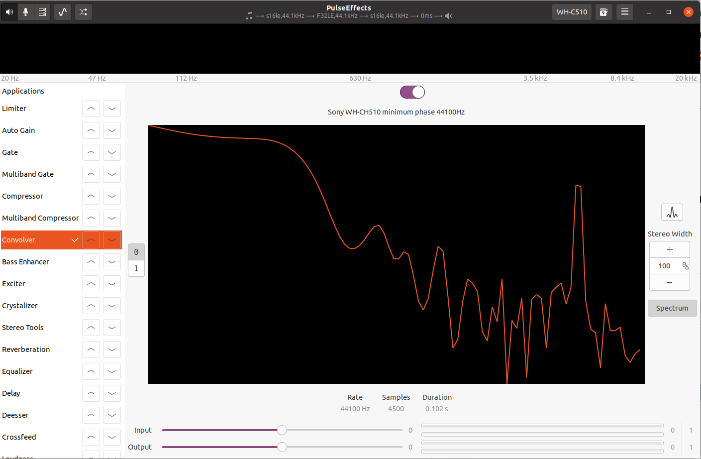

# PulseAudio

## PulseAudio Mic Echo Cancellation Feature

Echo cancellation is a useful tool to have while talking Skype etc **without headphones.**

**Source(s):** https://www.reddit.com/r/linux/comments/2yqfqp/just_found_that_pulseaudio_have_noise/

https://wiki.archlinux.org/index.php/PulseAudio/Troubleshooting#Enable_Echo/Noise-Cancellation

https://www.freedesktop.org/wiki/Software/PulseAudio/Documentation/User/Modules/#module-echo-cancel

### 1. Configuration For One Sound Card

- Run the following command:

```bash
$ sudo nano /etc/pulse/default.pa
```

- Add the following line:

```
load-module module-echo-cancel use_master_format=1 rate=48000
```

- Reload pulseaudio:

```bash
$ pulseaudio -k
```

- Select echo canceled sources in sound settings.
- Now everything is set up.


### 2. Configuration For Multiple Sound Cards

For example you are using usb sound card for output and built-in mic as input.

- Before starting we need `YOUR_SINK_MASTER` and `YOUR_SOURCE_MASTER` values. For getting these values select output and input devices which you are going to use in the sound settings of Ubuntu Settings. These values are `alsa_output.usb-C-Media_Electronics_Inc._USB_Advanced_Audio_Device-00.analog-stereo` and `alsa_input.pci-0000_00_1b.0.analog-stereo` respectively, for my situation.
- For getting the value `YOUR_SINK_MASTER` run the following command:

```bash
$ pactl list short sinks
```

- For getting the value `YOUR_SOURCE_MASTER` run the following command:

```bash
$ pactl list short sources
```

- Run the following command:

```bash
$ sudo nano /etc/pulse/default.pa
```

- Add the following lines: (Replace `YOUR_SINK_MASTER` and `YOUR_SOURCE_MASTER`)

```
load-module module-echo-cancel use_master_format=1 rate=48000 sink_name=sink_ec source_name=source_ec sink_master=YOUR_SINK_MASTER source_master=YOUR_SOURCE_MASTER
set-default-sink sink_ec
set-default-source source_ec
```

- Restart the PC.


## PulseAudio Crackling Sound Solution

The newer implementation of the PulseAudio sound server uses  timer-based audio scheduling instead of the traditional,  interrupt-driven approach. Timer-based scheduling may expose issues in some ALSA drivers. On the other hand, other drivers might be glitchy without it on, so check  to see what works on your system. **Apply this tweak if you are having cracking sound issue.**

**Source(s):** https://wiki.archlinux.org/index.php/PulseAudio/Troubleshooting#Glitches,_skips_or_crackling

https://wiki.archlinux.org/index.php/PulseAudio/Troubleshooting#Laggy_sound

- To turn timer-based scheduling off add `tsched=0` in `/etc/pulse/default.pa`: 

```bash
$ sudo nano /etc/pulse/default.pa
```

- Modify file as explained below:

```bash
# Change this line:
load-module module-udev-detect
# To this line:
load-module module-udev-detect tsched=0

# And add these lines to prevent popping sounds in some applications
default-fragments = 5
default-fragment-size-msec = 2
```

- Then restart the PulseAudio server: 

```bash
$ pulseaudio -k
$ pulseaudio --start
```

(RESTORE): Do the reverse to enable timer-based scheduling, if not already enabled by default. 


## PulseAudio Better Sound Quality

Tweak for audiophiles. Increasing sample rate in exchange of CPU time.

**Source:** https://wiki.archlinux.org/index.php/PulseAudio/Troubleshooting

- Modify pulseaudio config file:

```bash
$ sudo nano /etc/pulse/daemon.conf
```

- Add the following lines to the end of the file:

```
default-sample-format = s24ne
default-sample-rate = 44100
alternate-sample-rate = 48000
resample-method = speex-float-5
```

- Restart pulseaudio server:

```bash
$ pulseaudio -k
$ pulseaudio --start
```

- Check PulseAudio values:

```bash
$ watch -n 1 pactl list sinks short
```

**NOTE(1):** If you want to get high quality sound with using echo cancellation feature at the same time, just make sure that echo cancellation module enabled with `load-module module-echo-cancel use_master_format=yes`. For more information see `PulseAudio Mic Echo Cancellation Feature` section and `NOTE(3)` in this section.

**NOTE(2):** I have tried this with 96KHz and speex-float-10 but it end up only with high CPU usage. If you are only a listener, leave it as like in this guide, because pulseaudio will switch between 44.1kHz and 48kHz.

**NOTE(3):** There won't be sample rate switch while using `module-echo-cancel`. Maybe related to a bug in pulseaudio or in the module but I was unable to find anything about it.


## PulseEffects & AutoEQ

**Thread:** https://www.reddit.com/r/tuxedocomputers/comments/p55zrm/autoeq_pulseeffects_for_better_sound_quality_with/

Achieve better sound output with using IR's (Impulse Response) files which are obtained with a high-end hardware.

1. Go to https://github.com/jaakkopasanen/AutoEq/blob/master/results/INDEX.md and find your headset. Download .wav file (44100Hz one will do the job). Rename ".wav" extension as ".irs"
2. Install PulseEffects (`sudo apt install pulseffects`)
3. Connect your Bluetooth headset.
4. Open PulseEffects, create a new preset, name it with your headset.
5. Add **Convolver**. There should be a button on the right. Select the downloaded/renamed file.
6. If the bass is too low you can enable **Bass Enchancer,** or try **Crystalizer** and **Exciter** for another effects. You can add other effects as well if you would like. I personally prefer using only Convolver.
7. On the presets section of PulseEffects there is a recycle-like button that enables this preset automatically when the Bluetooth headset is connected. Enable this feature if you want. Also add a default preset with no effects for no other devices connected and make do the same thing.
8. If you enabled automatic preset feature then don't forget to enable **Start service at login** in the general settings of PulseEffects.

Note: Works for wired headsets too.

