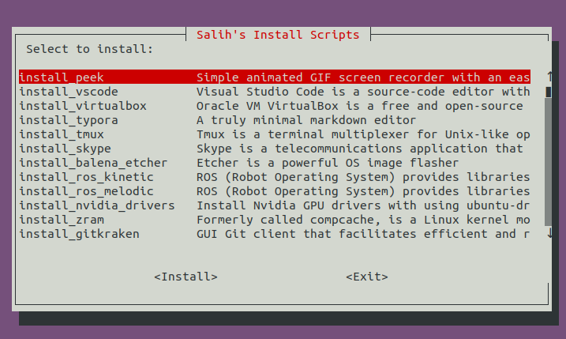

# All in One Installer

## Introduction

All in one installer which I use personally. As shown in the image below, the script allows to install programs with an easy CLI interface.




## Usage

```bash
$ ./all_in_one_installer.sh
```